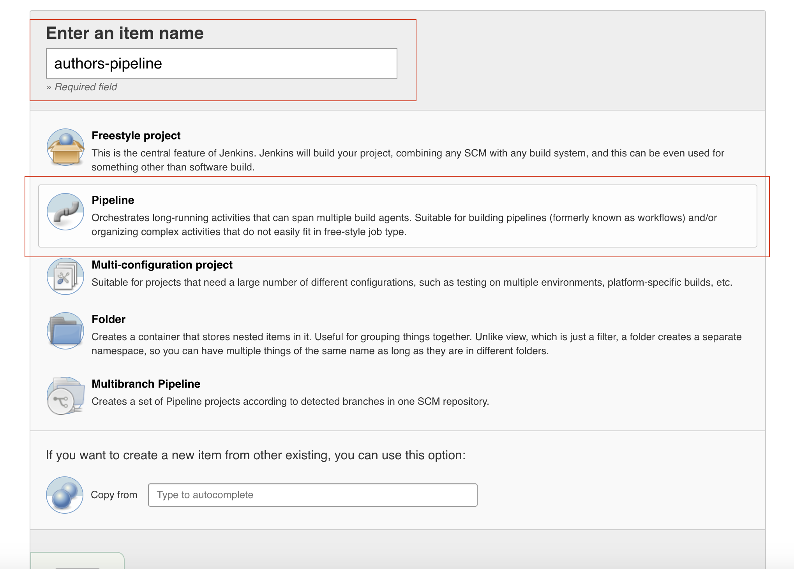
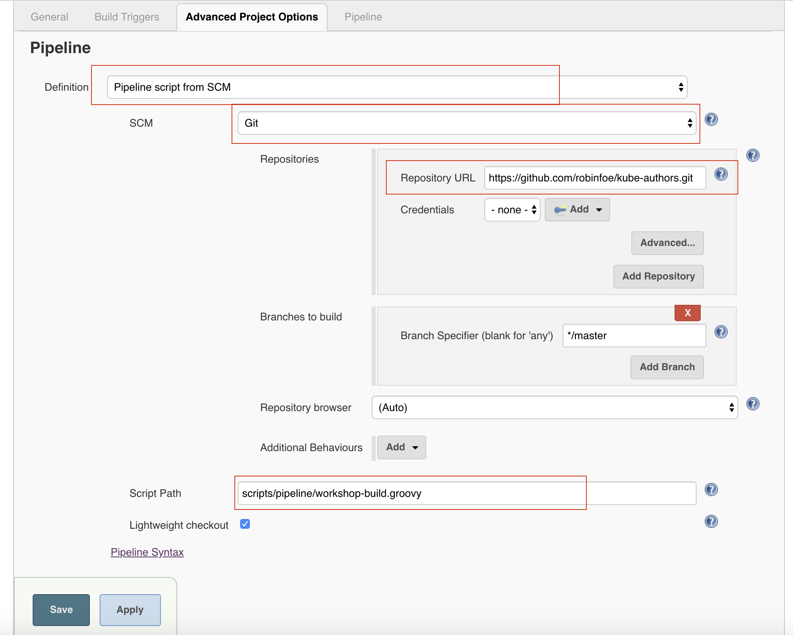

# [Jenkins] Blue Green deployment with Kubernetes 
This repository holds a setup script that for jenkins to perform blue/green deployment 

# Pre-requisite
I assume user have perform the following
- complete the setup step in the [main page](https://github.com/robinfoe/kube-authors/blob/master/README.md)

> [!NOTE]
> **For minikube environment, i have configured dnsmasq that point to nginx ingress with suffix .mkube**

# Setup

## Deploy jenkins

##### Navigate to namespace
    ## Navigate to kube-authors folder 
    cd %{WORKSPACE_HOME}/kube-authors/ 

    kubectl config set-context --current --namespace=workshop

##### Deploy Jenkins with helm
    helm install hl-jenkins stable/jenkins  --set rbac.create=false --set master.usePodSecurityContext=false --set master.adminPassword=password

    kubectl apply -f scripts/kube/ingress/ing-jenkins.yaml -n workshop
    

##### Create Kaniko Config map for docker push 
    kubectl apply -f scripts/kube/configmap/cm-docker-kaniko.yaml -n workshop

##### Create RBAC for Jenkins and kubectl container

    kubectl apply -f scripts/kube/role/role-cluster-admin-jenkins.yaml 
    
    kubectl apply -f scripts/kube/role/role-cluster-admin-default.yaml 

##### Configure Jenkins for CI/CD pipeline
Navigate to jenkins console ( http://jenkins.mkube ) , create a new pipepine job as per below

and in jenkins setup
- Definition : Pipeline script from SCM
- SCM: git
- repositories: https://github.com/robinfoe/kube-authors.git
- Scripts path : scripts/jenkins/pipeline/workshop-build.groovy

<!-- ## Sample Screen
- Current stat of applications
-->

