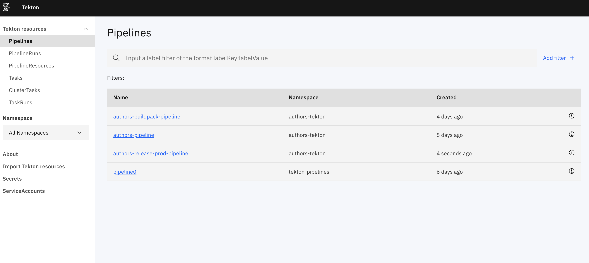
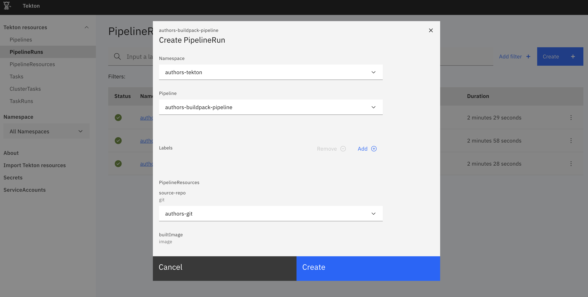
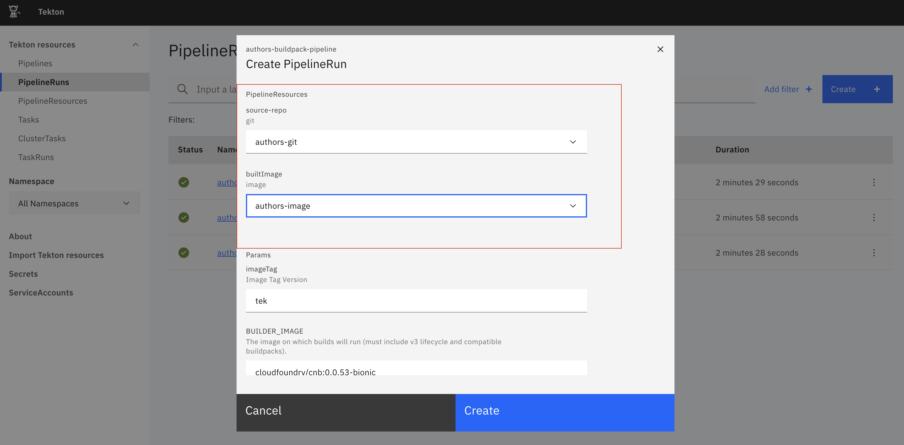
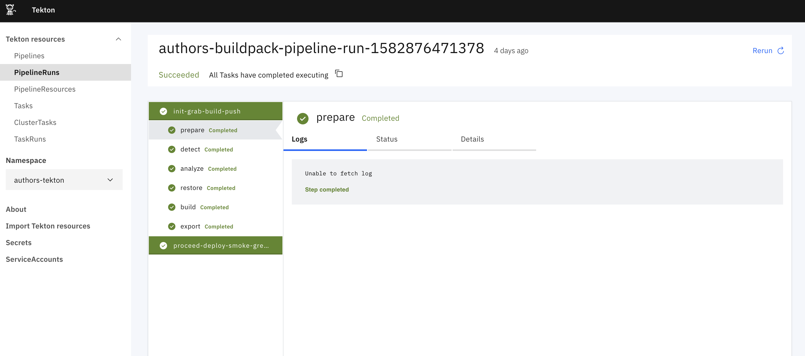

# [Tekton] Blue Green deployment with Kubernetes 
This repository holds a setup script that for tekton to perform blue/green deployment 

# Pre-requisite
I assume user have perform the following
- complete the setup step in the [main page](https://github.com/robinfoe/kube-authors/blob/master/README.md)

> [!NOTE]
> **For minikube environment, i have configured dnsmasq that point to nginx ingress with suffix .mkube**

# Setup

    ## Navigate to kube-authors folder 
    cd %{WORKSPACE_HOME}/kube-authors/ 

    

##### Deploy Tekton 
    kubectl apply -f scripts/tekton/tekton-setup-v0.10.1.yaml

> [!NOTE]
> **namespace called tekton-pipelines will be generated**

    
    kubectl config set-context --current --namespace=tekton-pipelines

    kubectl apply -f scripts/tekton/tekton-dashboard-release-v0.5.1.yaml

    kubectl apply -f scripts/tekton/tekton-ingress.yaml
    

##### Create Config map for docker push 
    kubectl config set-context --current --namespace=workshop

    kubectl apply -f scripts/kube/configmap/cm-docker-kaniko.yaml -n workshop

##### Create RBAC for tekton 

    kubectl apply -f scripts/kube/role/role-cluster-admin-default.yaml 

##### Create Tekton pipeline resources 

    kubectl create -f scripts/tekton/asset/resource
    kubectl create -f scripts/tekton/asset/task
    kubectl create -f scripts/tekton/asset/pipeline

##### Run the pipeline
Navigate to Tekton console ( http://tekton.mkube )
The pipeline will be shown as per below .

At this poing you can ignore namespace as it should be configured as workspace 

We have configured 3 pipeline 
 - authors-pipeline - Perform build with dockerfile and push to repository
 - authors-buildpack-pipeline - Perform build with Cloudfoundry CNB and push to repository
 - authors-release-prod-pipeline -  Perform deployment to production

To run the pipeline , do navigate to pipelineruns link and click on the create button
make sure you fill in the right value in the field.

Sample successfull pipeline runs

